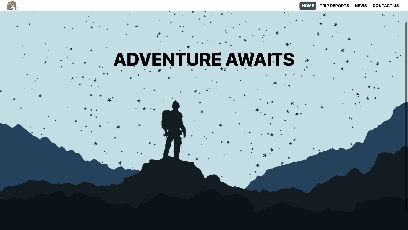

# DUSA Website

## Project Introduction

The current [DUSA](https://speleologicalassociation.webspace.durham.ac.uk/) (Durham University Speleology Association) website has become outdated, lacking in dynamic updates and effective presentation of club activities. With approval from DUSA executives, this project sets out to create a new, tailored website. I aim to address these issues directly, creating a website that more accurately reflects the club and facilitates easy content management.

## Objectives

- **Trip Reports**: We want the website to present the activities (i.e. trips) of the club, and having a trip report section (which is common in the sport) is a great way to advertise the club being active.
- **Archive**: A decades long historical archive of photos and newletters from past members (backuped and redundancy)
- **Visual and Interactive UX** To advertise the club to potential members
- **Admin Page**: So that non-technical users can interact with the page

## Technologies Used

- **Frontend** : HTML, CSS, Typescript, React.js (React because it's quick and there are a lot of resources and packages)
- **Backend** : Either Node.js or Django (I have experience in Django)
- **Database** : MongoDB or AWS (depending on pricing)
- **Deployment**: AWS (generous free tier)

## Development Logs

### Log 1 - 14/02/24

- **Navigation Bar**: Implemented a responsive navigation bar to facilitate easy site navigation.
- **Contact Page**: Added a responsive contact page, ensuring accessibility across various devices.
- **MVP Parallax Landing Page**: Developed a minimum viable product for the landing page featuring parallax scrolling effects to engage visitors immediately upon arrival.

