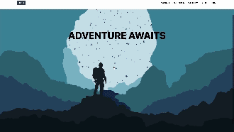

### I've re-started this project from scratch in a new [repo](https://github.com/Berat03/dusa-ui). 
Some reasons why include:
- Did not consider the backend. Initially made it with AWS serverless tools (S3, Lambda, DynamoDB, etc.), however, I intend to hand this website over at some point, and I don't want maintenance to be difficult. Will just host on a VPS, I'm thinking Vercel and Supabas.
- Did not utilise code formatting such as eslint and prettier enough.
- I didn't really have a goal in mind. Kind of aimless
- Did not consider the backend when designing the front end. Made it too specific, and now I also want to use GraphQL instead of RestAPI.
- I love my parallax effect on the landing page ('art' is mine too!), but it doesn't leave much room for a hero component-style landing page
- I used typescript, but I didn't utilise it properly.
- I over-extended myself by using too many tailwind ui components, without customising them for my use case. So the code is bloated.
- I also made some stuff from scratch, when I should have just used a library.

# DUSA Website

## Project Introduction

The current [DUSA](https://speleologicalassociation.webspace.durham.ac.uk/) (Durham University Speleology Association) website has become outdated, lacking in dynamic updates and effective presentation of club activities. With approval from DUSA executives, this project sets out to create a new, tailored website. I aim to address these issues directly, creating a website that more accurately reflects the club and facilitates easy content management.

## Objectives

- **Archive**: Create a (backed-up and redundant) archive for the club's extensive history of photos and newsletters, ensuring preservation and accessibility.
- **Full-Stack Website**: Create both the frontend and backend, ensuring redundancy and that others can look after the site after I leave.
- **Visual and Interactive UX**: Develop a visually appealing and interactive website to effectively promote the club to potential members.
- **Admin Page**: Provide an easy-to-use admin interface for non-technical users to update and manage the website content.
- 

## Technologies Used

- **Frontend** : HTML, CSS, Typescript, React.js (React because it's quick and there are a lot of resources and packages)
- **Backend** : Either Node.js, Django  or just basic Go (currently learning towards not using a backend framework, don't see much of a need).
- **Database** : AWS S3 Buckets (I calculated price and S3 is free/ very economical).
- **Deployment**: AWS Amplify or just something such as S3, again very cheap (and free for a year).

## Development Logs
<!-- ~7 hours so far I think, mainly art tbh -->
### Log 1 - 14/02/24 

- **Navigation Bar**: Implemented a responsive navigation bar to facilitate easy site navigation.
- **Contact Page**: Added a responsive contact page, ensuring accessibility across various devices.
- **MVP Parallax Landing Page**: Developed a minimum viable product for the landing page featuring parallax scrolling effects to engage visitors immediately upon arrival.

### Log 2 - 14/02/24 
<!-- ~20 hours so far I think, chatGPT struggles to do basic things waste of time, need to concentrate on mini-projects instead of branching out too much, need someone for second opinions  -->

### Implemented:
- **Gallery**: Initial page including main image dir
- **BlogFullScreen**: Added blog cards, working on individual blog pages
- **Contact Page**: Added mailing list
- **Landing Page**: Added basic images, stats and text to explain the club
- **Backend**: Found AWS S3 buckets to be the best practical and financial approach

### Difficulties:
- **Art**: I'm not too good at drawing, especially on a laptop
- **Design**: I want to site to look good and be memorable, but I'm struggling to justify (and find myself backtracking) on adding effects such as parallax-tilt on cards 
- **Admin Page**: Unsure how to structure my admin page

### Next Steps:
- **Calender**: Add a Calender page
- **Content**: Simplify fill with more context
- **Backend**: Connect Blog and Gallery backends to S3 buckets, will use Golang (good for backend's and also I like the language).

